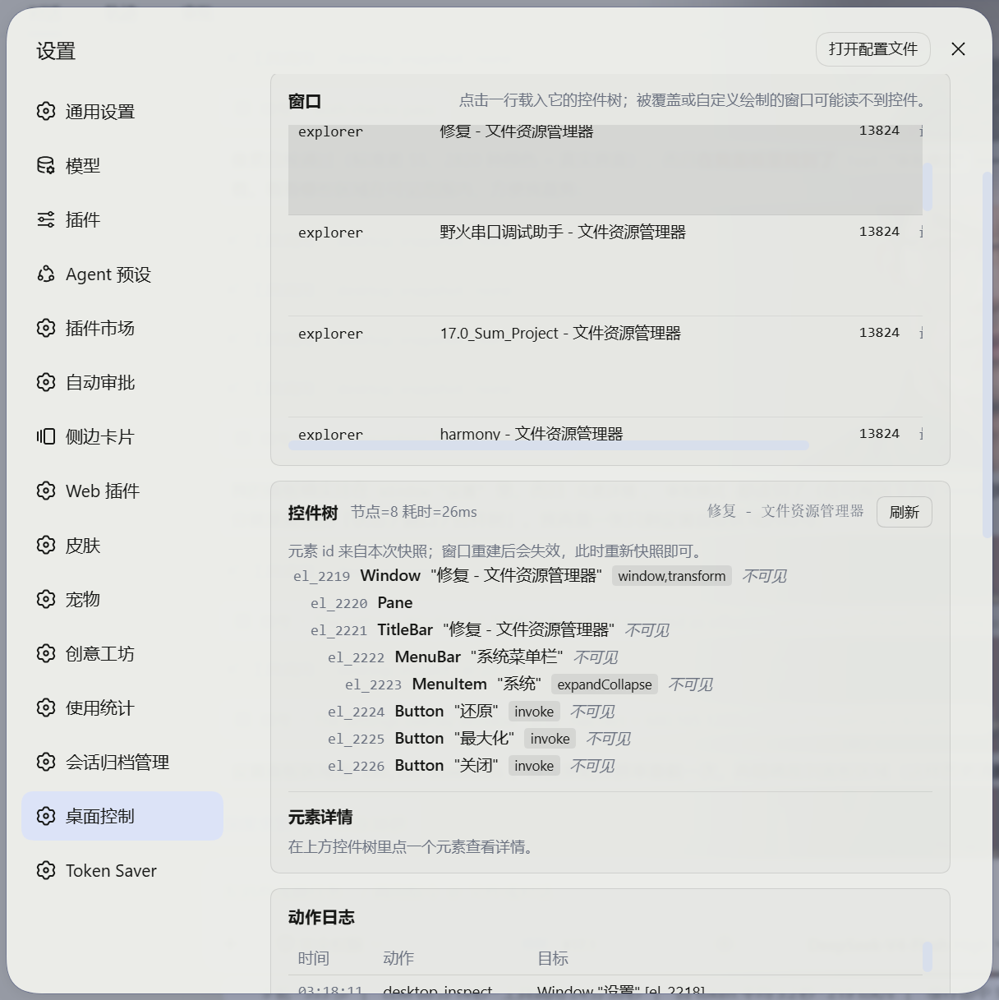

# Desktop control — user guide

> In one sentence: **ask the AI to operate apps on your computer, in plain language.**
> It does not "look at the screen and guess": it reads the list of controls a program exposes (the control tree), so it clicks precisely, can verify what it did, and never drags your mouse around.

Chinese version: [使用说明.md](使用说明.md)

---

## 1. What it can do for you

- Open a program, a Windows settings page, a document or a URL
- Find a button, menu or text box inside an app and click it (it prefers the control's own mechanism, so **your mouse does not move**)
- Type text into a field and send shortcuts such as `Ctrl+S`
- Read text, numbers, table contents and check-box states off the screen
- Wait for a window or a piece of content to appear, then continue
- Manage windows: bring to front, maximize, minimize, move, close
- Take a screenshot (if your model accepts images, it sees the picture directly)

**You just describe the task in your own words — there is no tool name to remember.**

---

## 2. Five-minute start

**Example 1 — let it do the maths**
> You: Open Calculator, work out 1234 × 56 and tell me the result.
>
> It: opens Calculator → reads every button → "presses" 1, 2, 3, 4, ×, 5, 6, = → reads the display → answers.
> The mouse never moves; you can watch the numbers change on screen.

**Example 2 — read a state off the UI**
> You: Is Wi-Fi on right now? Check the Settings window.
>
> It: finds the window → reads the control tree → reports the actual switch state (it reads the real UI, it does not guess).

**Example 3 — fill something in**
> You: Type "today: send the report" into Notepad and press Ctrl+S.
>
> It: types into the editor → saves → tells you what happened.

**Example 4 — close a window**
> You: Close the QQ window.
>
> It: finds the window → closes it → confirms the window really disappeared.

---

## 3. How to phrase requests (three rules)

1. **Name the target window** — "in Notepad…" works far better than "in that window…".
2. **One step at a time** — small steps beat a ten-step wish list.
3. **When something looks wrong, ask it to re-read** — "look again at what the window shows now". After every action it compares what changed, and when nothing changed it re-reads instead of clicking blindly.

---

## 4. When it asks you (approval)

By default it **follows DSH**: when DSH prompts for approval you get the prompt, and when DSH has prompting switched off (for example the "full access" permission preset) actions run directly.

You can change this in the panel:

| Setting | Effect |
| --- | --- |
| Approval mode | **Follow DSH** (default) / **Always ask** (prompt every time; refuse when nobody can be asked) / **Never ask** (run everything) |
| Trusted processes | Apps listed here are **never prompted** — e.g. Notepad, Excel |
| Blocked processes | These apps can **never be touched** |
| Only these processes | Filling this in turns it into an allow-list: nothing else may be driven |
| Compare after each action | Re-reads the window after every action and lists what appeared, vanished or moved (recommended) |
| Snapshot limits | How many levels/elements one read returns (lower it when reading feels slow) |

**Reads never prompt** (listing windows, reading the tree, element details, reading the clipboard, screenshots). **Only state-changing actions ask**: clicking, typing, key combinations, launching programs, writing the clipboard, changing a window.

**Every action is logged**, including what the AI looked at, in
`%APPDATA%\dsh-desktop\harness\storages\dsh-desktop-uia\audit.jsonl`, and in the panel.

---

## 5. The panel (Settings → Desktop control)



| Section | What it shows |
| --- | --- |
| **Service** | Whether the background helper is running, its PID, elevation state; buttons to refresh / self-test / restart it |
| **Windows** | Every visible top-level window (process, title, PID, state); click a row to read its control tree, or "bring to front" |
| **Control tree** | The element list of the selected window (id, type, name, available actions); click an element for its full properties |
| **Action log** | What the AI did and looked at, the outcome, and whether anything was refused |
| **Settings** | Everything from section 4; changes save immediately |

The panel only observes and configures — it never clicks anything. Every action still goes through a tool call and the approval policy.

---

## 6. Install / uninstall / update

**Easiest way** (no command line): download the release zip, unzip it anywhere, then **double-click `install.cmd`**. It builds nothing (the release ships a compiled sidecar), installs the plugin into your DSH profile, and runs a self-check. Restart DSH Desktop afterwards.

**From a clone or the source folder:**

```powershell
# install (double-click install.cmd, or run this)
powershell -ExecutionPolicy Bypass -File install.ps1

# update after editing the source: run it again (with a rebuild of the sidecar)
powershell -ExecutionPolicy Bypass -File install.ps1 -Rebuild

# uninstall; add -Purge to also delete stored settings and the action log
powershell -ExecutionPolicy Bypass -File uninstall.ps1
```

**DSH must be restarted** after installing or removing: the tools and the panel only appear once the profile is reloaded.

Self-check, also usable without DSH running (it really reads your desktop):

```powershell
node scripts\doctor.mjs
```

---

## 7. FAQ

**Q: Some apps show no controls at all. Why?**
Terminals, games, Paint and some media players draw themselves, so Windows exposes nothing inside. Those are screenshot-only targets. **For web pages, prefer the browser plugin** — it is faster and more accurate; this plugin is for desktop apps.

**Q: It cannot drive a particular app.**
That app runs as administrator while DSH does not. Either start that app normally, or **start DSH as administrator**.

**Q: It says an element is "stale". What now?**
The UI refreshed (you switched tabs, or the list reloaded), so the old element ids are void. It re-reads automatically — you do not need to do anything.

**Q: Will the mouse jump around?**
Normally no. Clicks prefer the control's own mechanism (Invoke/Value/Selection patterns), which works even when the window is covered and leaves the cursor untouched. Only custom-drawn surfaces fall back to coordinate clicks.

**Q: Could it click something I care about?**
Three layers of protection: ① state-changing actions pass approval (or at least get logged); ② every action is followed by a "what changed" comparison, so a miss is visible and it re-reads instead of retrying blindly; ③ the blocked/allow-list pins down exactly which apps may be driven.

**Q: Reading one window is very slow.**
Browser and Electron-based apps (VS Code, many chat clients) have slow accessibility providers. Ask it to "find just that button" instead of "read the whole window" — that is much faster.

**Q: The panel is missing / 404.**
DSH has not been restarted since installing, so the plugin is not loaded. Restart DSH Desktop.

**Q: Can it act on its own, without me?**
It acts only inside your conversation, on your request, and every action is recorded (action log plus `audit.jsonl`). If you want tighter control, clear the trusted list and set the approval mode to "Always ask" — then every step needs your confirmation.

---

## 8. Going deeper

- Full technical documentation (tool reference, approval implementation, performance notes, troubleshooting): [README.md](README.md) · 中文 [README.zh-CN.md](README.zh-CN.md)
- Automated tests and diagnostics: `node --import ./test/helpers/register.mjs --test "test/*.test.mjs"`, `node scripts/doctor.mjs`
